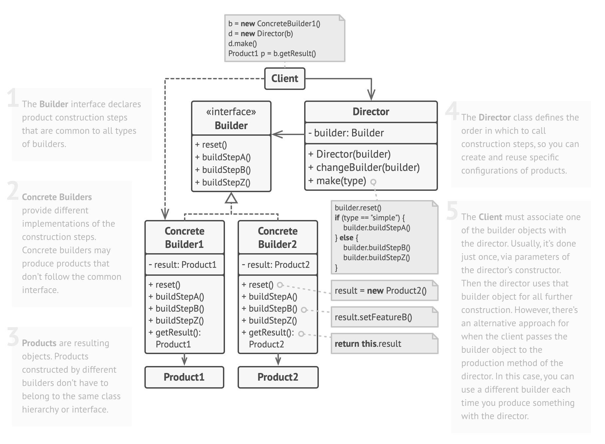

# BUILDER Design Principle

Some object are simple and ca be created in a single initializer call. However some objects require a lot of steps to be created. So having an object with 10 initializer arguments is not productive. Instead we opt for a piecewise construction.

The `Builder` design pattern provides an API for constructing an object step-by-step.

When piecewise object construction is complicated, the `Builder` provide an API for doing it succinctly.

A builder is a separate component for building an object. You can either give it an initializer or return it wia a static function.
To make the builder fluent, return self.
Different facets of an object can be built with different builders working in tandem via a base class.

Example. We want an html list of words.
```javascript
const words = ['hello', 'world']
html = []
html.push('<ul>\n')
for (let word of words) 
    html.push(`  <li>${word}</li>\n`)
html.push('</ul>')
console.log(html.join(''))
```

Better approach:
```javascript
class Tag {
    constructor(name='', text='') {
        this.name = name;
        this.text = text;
        this.children = [];
    }

    static get indentSize() { return 2; }

    toStringImplementation(indent) {
        let html = [];
        let i = ' '.repeat(indent * Tag.indentSize);
        html.push(`${i}<${this.name}>\n`);
        if (this.text.length > 0) {
            html.push(' '.repeat(Tag.indentSize * (indent + 1)));
            html.push(this.text);
            html.push('\n');
        }

        for (let child of this.children)
            html.push(child.toStringImplementation(indent + 1));

        html.push(`${i}</${this.name}>\n`);
        return html.join('');
    }

    toString() { return this.toStringImplementation(0); }

    static create(name) { return new HtmlBuilder(name); }
}

class HtmlBuilder {
    constructor(rootName) {
        this.root = new Tag(rootName);
        this.rootName = rootName;
    }

    // non-fluent
    addChild(childName, childText) {
        let child = new Tag(childName, childText);
        this.root.children.push(child);
    }

    // fluent - very common when dealing with interfaces
    addChildFluent(childName, childText) {
        let child = new Tag(childName, childText);
        this.root.children.push(child);
        return this;
    }

    toString() { return this.root.toString(); }

    build() { return this.root; }

    clear() { this.root = new Tag(this.rootName); }
}

const builder = new HtmlBuilder('ul');
for (let word of words) builder.addChild('li', word);
console.log(builder.build().toString());

// initializing through the TAG object - this introduces coupling, so not a good way to do it
const builder1 = Tag.create('ul');
for (let word of words) builder.addChild('li', word);
console.log(builder.build().toString());

builder.clear();
builder.addChildFluent('li', 'foo').addChildFluent('li', 'bar').addChildFluent('li', 'baz')
console.log(builder.toString())
```

Sometimes a single builder is not enough to build the object. So you can introduce several builders within a bigger builder in order to build the proper interface.

```javascript
class Person {
    constructor() { 
        // address
        this.streetAddress = this.postcode = this.city = '';

        // employment
        this.companyName = this.position = '';
        this.annualIncome = 0;
    }

    toString() { 
        return `Person lives at ${this.streetAddress}, ${this.city}, ${this.postcode}\n`
        + `and works at ${this.companyName} as a ${this.position} earning ${this.annualIncome}`;
    }
}

class PersonBuilder {
    constructor(person = new Person()) {    // we create the One single object and store it inside the PersonBuilder
        this.person = person;
    }

    get lives() { 
        return new PersonAddressBuilder(this.person);
    }

    get works() { 
        return new PersonJobBuilder(this.person);
    }

    build() { return this.person; }
}

class PersonAddressBuilder extends PersonBuilder {
    constructor(person) {
        super(person);
    }

    at(streetAddress) {
        this.person.streetAddress = streetAddress;
        return this;
    }

    withPostcode(postcode) {
        this.person.postcode = postcode;
        return this;
    }

    in(city) {
        this.person.city = city;
        return this;
    }
}

class PersonJobBuilder extends PersonBuilder {
    constructor(person) {
        super(person);
    }

    at(companyName) {
        this.person.companyName = companyName;
        return this;
    }

    asA(position) {
        this.person.position = position;
        return this;
    }

    earning(annualIncome) {
        this.person.annualIncome = annualIncome;
        return this;
    }
}

let pb = new PersonBuilder();
let person = pb.lives.at('123 London Road').in('London').withPostcode('SW12BC').works.at('Fabrikam').asA('Engineer').earning(123000).build();
console.log(person.toString());
```

#### [Refactoring Guru](https://refactoring.guru/design-patterns/builder)

Creational design pattern that lets you construct complex objects step by step.

Problem: Creation of a house. Some houses have garage, some have swimming pool, some have garden etc.

Bad Solution: a class that receives a lot of parameters in the constructor, where you would send something like this:
```javascript
// constructor
House(windows, doors, room, hasGarage, hasSwimPool, hasGarden...)

const house = new House(4, 2, 4, true, null, true...)
```

Better Solution using Builder: we will have a house builder that will call several separate objects to create the house parts. Ex.
```javascript
class HouseBuilder{
    ...
    buildWalls()
    buildDoors()
    buildWindows()
    buildRoof()
    buildGarage()
    getResult() {return House}
}
```

The **Director** - we can extract several calls into a separate class called Director. This class defines the order in which to execute the building steps, while the builder provides the implementation for those steps. The director class might be a good place to put various construction routines so you can reuse them across your program. In addition, the director class completely hides the details of product construction from the client code.



Pros: 
- Construct objects step-by-step, defer construction steps or run steps recursively
- Reuse the same construction code when building various representations of products
- Single Responsibility Principle, where you isolate complex construction code from the business logic of the product

Cons: 
- overall complexity of the code increases since the pattern requires creation of multiple new classes

#### Relations with Other Patterns
- Many designs start by using **Factory Method** (less complicated and more customizable via subclasses) and evolve toward **Abstract Factory**, **Prototype**, or **Builder** (more flexible, but more complicated).

- **Builder** focuses on constructing complex objects step by step. **Abstract Factory** specializes in creating families of related objects. **Abstract Factory** returns the product immediately, whereas Builder lets you run some additional construction steps before fetching the product.

- You can use **Builder** when creating complex Composite trees because you can program its construction steps to work recursively.

- You can combine **Builder** with **Bridge**: the director class plays the role of the abstraction, while different builders act as implementations.

- **Abstract Factories**, **Builders** and **Prototypes** can all be implemented as **Singletons**.
