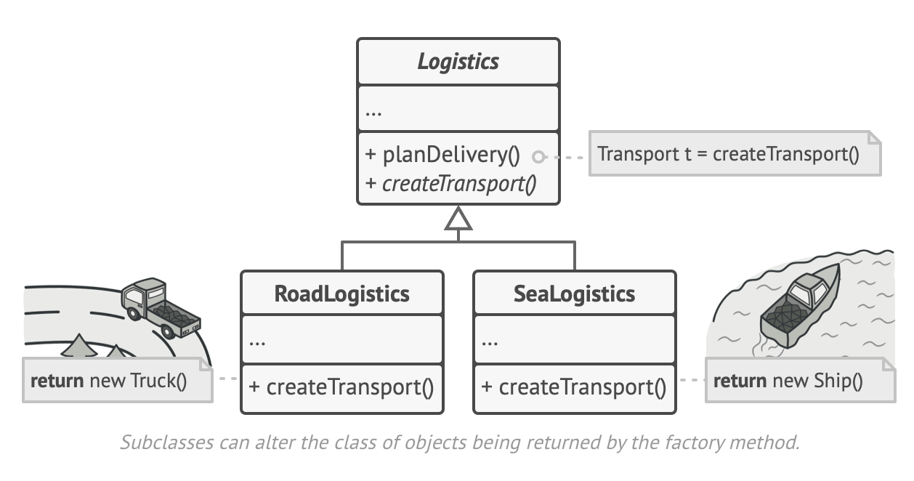

# FACTORY Design Principle

We use this design pattern for wholesale object creation, so we outsource the process of initializing the object.

We can use:
- Separate method (Factory Method)
- Separate class (Full Factory Method)
- Create a hierarchy of factories with Abstract Factory Method

A factory is a component responsible solely for the wholesale (not piecewise) creation of objects.

A factory method is a static method that creates objects. A factory is an entity that can take care of object creation. It can be external or reside inside the object as an inner class. Hierarchies of factories can be used to create related objects.

In the example below we are trying to create a point that will be initiated differently depending on the coordinate system. The first block is how we could do it, and the second block is doing it better with the Factory Design Pattern:
```javascript
CoordinateSystem = {
    cartesian: 0,
    polar: 1
}
class Point {
    constructor(a, b, coordinate=CoordinateSystem.cartesian) {
        switch (coordinate) {
            case CoordinateSystem.cartesian:
                this.x = a;
                this.y = b;
                break;
            case CoordinateSystem.polar:
                this.x = a * Math.cos(b);
                this.y = a * Math.sin(b);
                break;
        }
    }
}
let p1 = new Point(4, 5, 0)
console.log(p1)
```

```javascript
class PointFactory {
    constructor (x,y) {
        this.x = x;
        this.y = y;
    }

    static newCartesianPoint(x, y) {
        return new Point(x, y);
    }

    static newPolarPoint(rho, theta) {
        return new Point(rho * Math.cos(theta), rho * Math.sin(theta));
    }
}

let p2 = PointFactory.newCartesianPoint(4, 5)
console.log(p2)
```

The idea of the **Abstract Factory** is that you can have a hierarchy of object and a related hierarchy of types.

Ex. hot drinks machine.
```javascript
class HotDrink {
    consume() {
        console.log('Having a hot drink is always good!')
    }
}

class Tea extends HotDrink {
    consume() {
        console.log('Tea is good!')
    }
}

class Coffee extends HotDrink {
    consume() {
        console.log('Coffee is too hot!')
    }
}

class HotDrinkFactory {
    prepare(amount) {}
}

class TeaFactory extends HotDrinkFactory {
    prepare(amount) {
        console.log(`Put tea bag, boil water, and pour ${amount}ml to the cup`)
        return new Tea()
    }
}

class CoffeeFactory extends HotDrinkFactory {
    prepare(amount) {
        console.log(`Grind coffee beans, boil water, and pour ${amount}ml to the cup`)
        return new Coffee()
    }
}

const AvailableDrinks = Object.freeze({
    coffee: CoffeeFactory,
    tea: TeaFactory
})

class HotDrinkMachine {
    constructor() {
        this.factories = {};
        for (let drink in AvailableDrinks) {
            this.factories[drink] = new AvailableDrinks[drink]();
        }
    }
    // better way
    makeDrink(type, amount) {
        let d = this.factories[type].prepare(amount)
        d.consume()
    }
    // old way
    // makeDrink(type, amount) {
    //     switch (type) {
    //         case 'tea':
    //             return new TeaFactory().prepare(amount)
    //         case 'coffee':
    //             return new CoffeeFactory().prepare(amount)
    //         default:
    //             throw new Error("I don't know how to make this type of drink")
    //     }
    // }
}

let machine = new HotDrinkMachine();
// let drink = machine.makeDrink('tea', 50).consume();
let drink = machine.makeDrink('tea', 50);
```

#### [Refactoring Guru Factory Method](https://refactoring.guru/design-patterns/factory-method)

Creational design pattern that provides an interface for creating objects in superclass, but allows subclasses to alter the type of object that will be created.

Example: You have a logistic app for deliveries with trucks. Then it surges the necessity to add ships too. Then comes the planes, etc. So you implement a factory method called `Logistics` that has the `createTransport` method. Then you have other classes that extend the `Logistics` class and rewrite the `createTransport` method: the `RoadLogistics` return a new Truck, the `SeaLogistics` return a new Ship, etc.



Limitation: subclasses may return different types of products only if these products have a common base class or interface. Also, the factory method in the base class should have its return type declared as this interface. Ex. the `Truck` extends the `Transport` class or has the `Transport` interface as it's base. Same thing applies to the `Ship`.


Use the **Factory Method** when you don't know beforehand the exact types and dependencies of the objects your code should work with. Also when you want to provide users of your lib or framework with a way to extend its internal components. Lastly, when you want to save system resources by reusing existing objects instead of rebuilding them each time.

Pros:
- Avoid tight coupling between the creator and the concrete products
- Single Responsibility Principle. You can move the product creation code into one place in the program, making the code easier to support
- Open/Closed Principle. You can introduce new types of products into the program without breaking existing client code

Cons:
- The code may become more complicated since you need to introduce a lot of new subclasses to implement the pattern. The best case scenario is when you're introducing the pattern into an existing hierarchy of creator classes.

#### Relations with Other Patterns
- Many designs start by using **Factory Method** (less complicates and more customizable via subclasses) and evolve toward **Abstract Factory, Prototype, or Builder** (more flexible, but more complicated)

- **Abstract Factory** classes are often based on a set of **Factory Methods**, but you can also use **Prototype** to compose the methods on these classes
  
- You can use **Factory Method** along with **Iterator** to let collection subclasses return different types of iterators that are compatible with the collections
  
- **Prototype** isn't based on inheritance, so it doesn't have its drawbacks. On the other hand, **Prototype** requires a complicated initialization of the cloned object. **Factory Method** is based on inheritance but doesn't require initialization step.
  
- **Factory Method** is a specialization of **Template Method**. At the same time, a **Factory Method** may serve as a step in a large **Template Method**


#### [Refactoring Guru Abstract Factory Method](https://refactoring.guru/design-patterns/abstract-factory)

Creational design pattern that lets you produce families of related object without specifying their concrete classes.