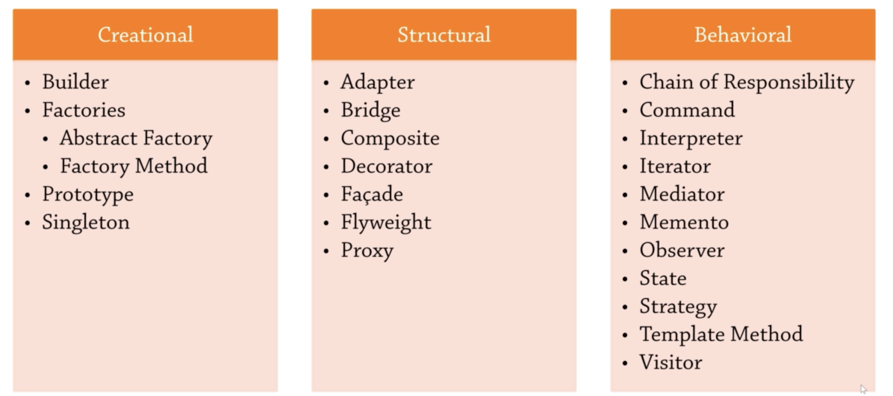

# Design Patterns

Design Patterns are common architectural approaches. It was popularized by the `Gang of Four` book (1994).
Are universally relevant and have since being internalized in some programming languages and several libraries.

The Patterns are:

